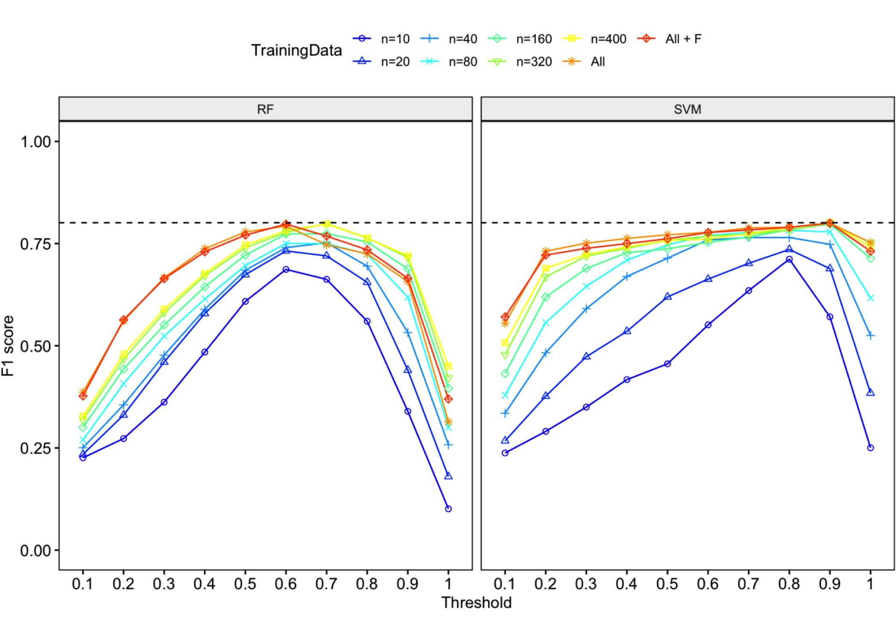

<!-- README.md is generated from README.Rmd. Please edit that file -->

# Workflow-for-automated-detection-and-classification-gibbon-calls

This is the code for Clink et al. 2023 (full citation below). Please
cite this publication if using or reproducing any of the code or figures
included here.

Clink, D. J., Kier, I.A.\*, Ahmad, A.H. & H. Klinck. (2023). A workflow
for the automated detection and classification of female gibbon calls
from long-term acoustic recordings. Frontiers in Ecology and Evolution.
11:1071640. doi: 10.3389/fevo.2023.1071640

# Quick start guide

## You can install the development version of the R package ‘gibbonR’ from [GitHub](https://github.com/DenaJGibbon) with:

``` r
install.packages("devtools")
devtools::install_github("DenaJGibbon/gibbonR")
library(gibbonR)
```

## Tutorial for gibbonR

<https://denajgibbon.github.io/gibbonR-tutorial/>

## You can download the required data from Zenodo:

Download and unzip files to a local drive that can be accessed using R.
doi: 10.5281/zenodo.7562095

# R script descriptions

### Part 1. Random iterations

This script randomly subsets the training data into subsets (n=
10,20,40,80,160,320,400) over 10 iterations. The varying numbers of
training data are used in the detector/classifier over the validation
data set.

### Part 2. Performance metrics on validation dataset

This script calculates area under the curve and F1 score for all of the
random iterations.


### Part 3. Performance metrics on test dataset

This script calculates the final performance metrics on the test
dataset.

### Part 4. Compare manual and automated annotations

This script compares the automated detections output by the system with
manual annotations done by a human observer using LTSAs.


### Part 5. Unsupervised clustering of true/false positives

This script uses affinity propagation clustering on labeled true/false
positives.


### Part 6. Unsupervised clustering of female calls

This script uses affinity propagation clustering on high-quality female
gibbon calls.


### Part 7. Female call exemplar plots

This script plots cluster assignment by recorder location and adds an
exemplar spectrogram to the plot.


